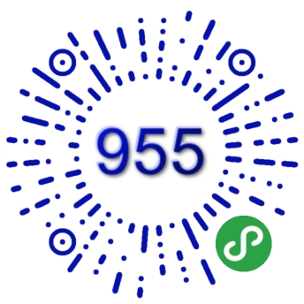

# 955.WLB

[996.ICU](https://github.com/996icu/996.ICU) opposite Repo. Designed to allow more people to flee 996 and join the ranks of 955.

996 Work system: that is, 9 am every day, and work until 9 o'clock in the evening. Work 6 days a week.

955 Work system: that is, 9 am every day, and work until 5 o'clock in the evening. Work 5 days a week.

955.WLB: Work 955, work life balance.

## Description

The list of the above companies, which are basically not affiliated with 996, is relatively close to the level of 955/965, but still depends on the department and region, and cannot guarantee complete accuracy.

## 955 Companies List

* Autodesk - Beijing/Shanghai
* Cisco - Beijing/Shanghai/Hangzhou/Suzhou
* Coolapk (酷安) - Beijing/Shenzhen
* Douban (豆瓣) - Beijing
* eBay - Shanghai
* EMC - Shanghai
* Ericsson - Shanghai
* Google - Beijing/Shanghai
* HP - Shanghai
* HSBC - Shanghai
* IBM - Shanghai (except GBS)
* Intel - Shanghai
* LeetCode - Shanghai
* LintCode/九章算法 - Hangzhou/Remote
* Microsoft - Beijing/Shanghai/Suzhou
* Oracle - Shanghai
* PayPal - Shanghai
* Pivotal - Beijing/Shanghai
* RingCentral - Xiamen
* SAP - Shanghai
* Splunk - Shanghai
* SUSE - Beijing/Shanghai/Shenzhen
* ThoughtWorks - Xi'an/Beijing/Shenzhen/Chengdu/Wuhan/Shanghai
* Vipshop (唯品会) - Shanghai
* VMware - Beijing/Shanghai
* WeWork - Shanghai
* Works Applications - Shanghai

Go to [vote_for_955_companies.md](./vote_for_955_companies.md) to vote.

## Add Company

Please click on the link below to vote or add a new company, I will handle it uniformly. Please add a new company, please indicate the place of work. If it is a domestic company, please add the company's Chinese name (for example: `Xiaomi (小米)`).

## WeChat Mini Program

You could see the full list of 955 companies through [955WLB](https://github.com/formulahendry/weapp-955-wlb) WeChat Mini Program.

